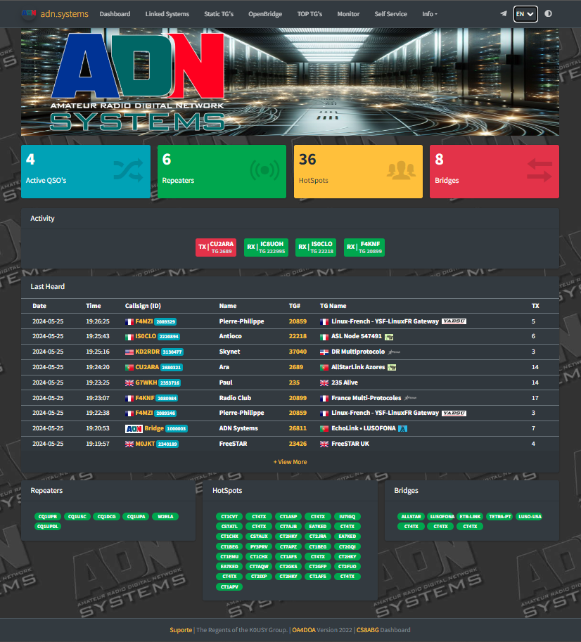

## ADN Systems Dashboard by CS8ABG



## Install Instructions

Supported versions: Debian 10, Debian 11, Ubuntu 18.04, 20.04, 22.04.

```bash
apt-get install -y curl
```

```bash
curl -sSL https://raw.githubusercontent.com/Amateur-Digital-Network/ADN-Dashboard/main/install.sh -o install.sh && bash install.sh
```


## Flags:
***Flags have been introduced to add visual indicators for Talkgroups (TG) or DMR IDs. To enable flags for specific TGs or DMR IDs, follow these steps:***

- If you see the world flag flickering in the `lastheard`, `Linked systems`, etc. tables, you need to add or copy a new flag image in the `flags` folder.
- The flag image should be named with the first three digits of the Talkgroup or DMR ID.
- For example, if the Talkgroup is 12345678, place a file called `123.png` in the `flags` folder.

## Repeaters, Hotspots, and Bridges:
***The dashboard now distinguishes between Repeaters, Hotspots, and Bridges based on their DMR IDs and/or TX/RX frequency.***

- If a DMR ID has 6 digits, it is considered a Repeater and will be displayed in the `Repeaters` table.
- If a DMR ID has 7 digits or more and has a TX/RX frequency associated with it, it is recognized as a Hotspot and will be shown in the `Hotspots` table.
- If a DMR ID has 7 digits or more and has a TX/RX frequency of 0 (zero), it is identified as a Bridge and will appear in the `Bridges` table.


---
**Credits**

Python 3 implementation of N0MJS HBmonitor for HBlink https://github.com/kc1awv/hbmonitor3

HBMonitor v2 for DMR Server based on HBlink/FreeDMR https://github.com/sp2ong/HBMonv2 

FDMR Monitor for FreeDMR Servera based on HBMonv2 https://github.com/yuvelq/FDMR-Monitor

---

This program is free software; you can redistribute it and/or modify it under the terms of the GNU General Public License as published by the Free Software Foundation; either version 3 of 
the License, or (at your option) any later version.

This program is distributed in the hope that it will be useful, but WITHOUT ANY WARRANTY; without even the implied warranty of MERCHANTABILITY or FITNESS FOR A PARTICULAR PURPOSE. See the 
GNU General Public License for more details.

You should have received a copy of the GNU General Public License along with this program; if not, write to the Free Software Foundation, Inc., 51 Franklin Street, Fifth Floor, Boston, MA 
02110-1301  USA

---